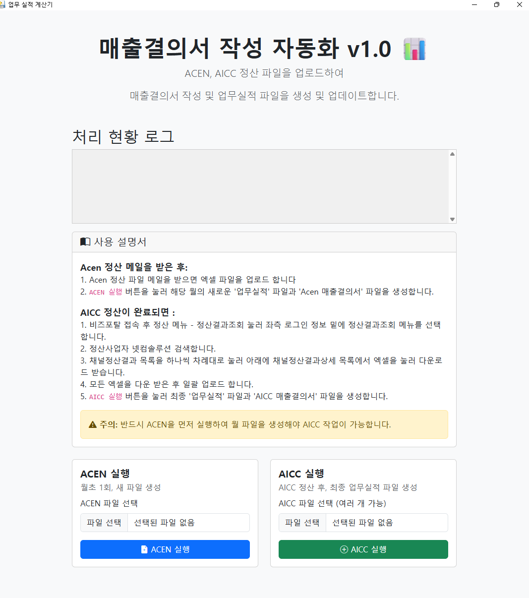

# 📊 매출결의서 작성 자동화 프로그램

월별 반복되는 ACEN, AICC 정산 자료 취합 및 업무실적 파일 생성을 자동화하여  
업무 효율을 극대화하는 데스크톱 애플리케이션입니다.

---

## 🚀 다운로드

👉 [최신 실행 파일 다운로드](https://github.com/Seoptrike/KT-Auto-Report/releases/latest)

[1.0.0 다운로드] (https://github.com/Seoptrike/KT-Auto-Report/releases/download/v1.0.0/KT_auto_report_v1.0.exe)

---

## ✨ 프로젝트 개요

매월 진행되는 정산 업무는 다수의 Excel 파일을 수작업으로 취합해야 하므로  
시간이 많이 소요되고 인적 오류(Human Error) 발생 가능성이 높습니다.  

이 프로젝트는 해당 과정을 완전 자동화하여  
- 업무 시간을 분 단위로 단축하고  
- 데이터의 정확성을 100% 보장  

하는 것을 목표로 개발되었습니다.

---

## 📸 스크린샷

---

## 🚀 주요 기능

- 💻 데스크톱 GUI: 웹 기술(HTML, CSS, Bootstrap) 기반  
- 📂 엑셀 자동 처리: ACEN 및 다중 AICC 파일 업로드 → 자동 통합  
- ⚡ 자동 연산: win32com을 활용한 업무실적 파일 업데이트 및 계산  
- 📜 작업 로그 표시: 비동기 처리 기반의 실시간 로그 확인  
- 📦 결과물 자동 저장: 최종 결과물(.zip)을 다운로드 폴더에 저장  
- 🔨 손쉬운 배포: 단일 실행 파일(.exe) 빌드 및 배포 지원  

---

## 🛠️ 기술 스택

- 언어: Python  
- 백엔드: Flask  
- 프론트엔드: HTML, CSS (Bootstrap 5)  
- 라이브러리: pywebview, win32com, openpyxl  
- 패키징: PyInstaller  

---

## ⚙️ 로컬 실행 방법

1. 저장소 클론
    git clone https://github.com/Seoptrike/KT-Auto-Report.git
    cd KT-Auto-Report

2. 가상환경 생성 및 활성화 (권장)
    python -m venv venv
    source venv/bin/activate      # macOS/Linux
    .\venv\Scripts\activate       # Windows

3. 의존성 설치
    pip install -r requirements.txt

4. 개발 모드 실행
    python develop.py

---

## 📦 EXE 파일로 빌드하기

PyInstaller를 이용하여 단일 실행 파일(.exe)을 생성할 수 있습니다.

    pyinstaller --onefile --windowed \
        --hidden-import=win32com.client \
        --add-data "templates;templates" \
        --add-data "업무실적계산기.xlsx;." \
        --add-data "services;services" \
        app.py

- 생성된 실행 파일은 dist/ 디렉토리에서 확인할 수 있습니다.

---

## 📝 라이선스

이 프로젝트는 MIT License를 따릅니다.
